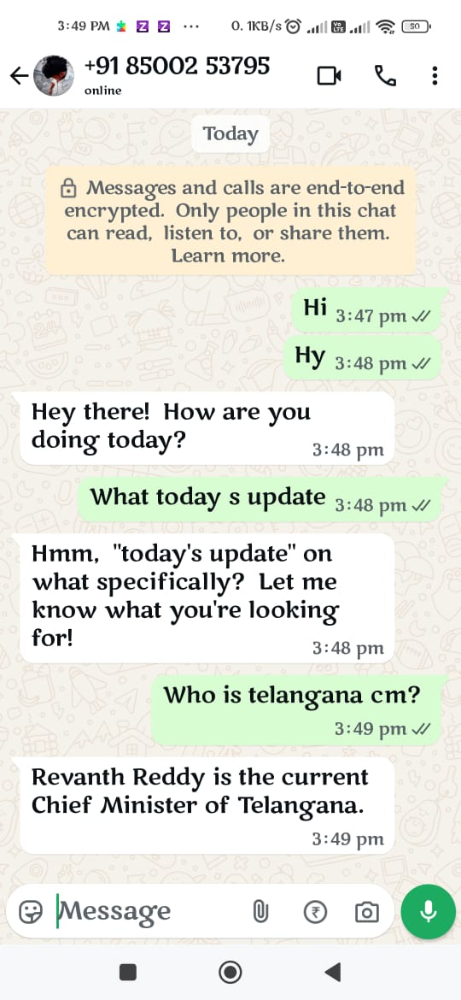

# Evolution Manager (WhatsApp) — Quick Start

Use the **already hosted** Evolution Manager to get WhatsApp running in minutes.

---

## 1) Log in
Copy the URL and Paste in browser : `https://evolution-api-v1-8-7-6big.onrender.com/manager/`  
Fill the form and click **Login**:

- **Server URL:** `https://evolution-api-v1-8-7-6big.onrender.com`  
- **API Key Global:** `21uk1a66a121uk1a66a1`


---

## 2) Create an instance
Click **Instance +** (top-right).


---

## 3) Fill instance details → Save
- **Name:** e.g. `WhatsApp Support`  
- **Channel:** `Baileys`  
- **Token:** use the generated value (keep it)  
- **Number:** **leave blank** (Baileys links via QR)

Click **Save**.


---

## 4) Link your WhatsApp (QR)
On the instance dashboard, click **Get QR Code**.


On your phone: **WhatsApp → Settings → Linked devices → Link a device**, then scan the QR.  
Wait until the instance shows **Connected**.


---

## 5) Set up Webhook (to receive messages)
Go to **Events → Webhook** and configure:

- **Enabled:** ON  
- **URL:** your receiver (e.g., n8n)  
  - Example: `https://YOUR_N8N_HOST/webhook/my-whats-app`  
- **Webhook Base64:** ON (helps with media)


Scroll down:

- Enable the event **`MESSAGES_UPSERT`**
- Click **Save**


---

## 6) Test 
Send a WhatsApp message to the linked number and confirm your webhook (e.g., n8n) receives the event.

**Notes**
- If the QR expires, click **Restart** then **Get QR Code** again.
- Keep the instance **Token** secret; it’s required for API calls from clients.


# n8n WhatsApp Auto-Reply — Quick Start

This guide shows how to install the **Evolution API** community node and run the WhatsApp auto-reply workflow.

---

## Prerequisite — Install the community node

1. **Go to Settings**  
   In n8n, click your avatar (bottom-left) → **Settings**.  
   

2. **Open Community nodes**  
   In the left sidebar, click **Community nodes** and then click **Install** (top-right).  
   

3. **Install the package**  
   In the modal, paste the npm package name: **`n8n-nodes-evolution-api-english`**.  
   Tick **I understand the risks…**, then click **Install**.  
   

4. **Confirm it shows as installed**  
   You should now see the package listed as installed.  
   

5. **Verify in editor**  
   Back in the workflow editor, click **+** and search **Evolution API** — the node should appear.  
   

---

**Connections:** Webhook → AI Agent → Send text; Groq Chat Model → AI Agent (ai_languageModel); Simple Memory → AI Agent (ai_memory).

---
# n8n WhatsApp Auto-Reply — Quick Start

This guide shows how to install the **Evolution API** community node and run the WhatsApp auto-reply workflow.

---

## Prerequisite — Install the community node

1. **Go to Settings**  
   In n8n, click your avatar (bottom-left) → **Settings**.  
   

2. **Open Community nodes**  
   In the left sidebar, click **Community nodes** and then click **Install** (top-right).  
   

3. **Install the package**  
   In the modal, paste the npm package name: **`n8n-nodes-evolution-api-english`**.  
   Tick **I understand the risks…**, then click **Install**.  
   

4. **Confirm it shows as installed**  
   You should now see the package listed as installed.

5. **Verify in editor**  
   Back in the workflow editor, click **+** and search **Evolution API** — the node should appear.  
   


## A) Webhook (Trigger)

- **Node:** Webhook  
- **HTTP Method:** `POST`  
- **Path:** `my-whats-app`

This generates **Test** and **Production** URLs. Copy the **Production** URL into **Evolution Manager → Events → Webhook → URL**.

> **Why?** Evolution sends incoming WhatsApp events to this webhook (same as the JSON’s `path: "my-whats-app"`).

---

## B) Groq Chat Model

- **Node:** Groq Chat Model  
- **Model:** `qwen/qwen3-32b`  
- **Credentials:** your Groq account

---

## C) Simple Memory (short chat memory per user)

- **Node:** Simple Memory (Buffer Window)  
- **Session ID type:** Custom key  
- **Session key (Expression):**
```js
={{ $json.body.data.key.id }}
```
- **Context window length:** `15`

> Uses the WhatsApp message key so replies stay contextual.

---

## D) AI Agent (author your reply)

- **Node:** AI Agent  
- **Text (Prompt input):**
```txt
=Input : {{ $json.body.data.message.conversation }}
```
- **System Message (paste):**
```txt
You are an advanced WhatsApp conversational AI that responds like a real human — natural, empathetic, and professional yet friendly.

You receive structured input with keys:
- conversation: latest WhatsApp message text
- sender: sender’s WhatsApp ID
- remoteJid: recipient’s WhatsApp ID
- date_time: ISO timestamp
- messageType: usually "conversation"

GOAL
Respond instantly in a human-like, context-aware, emotionally intelligent way. Keep replies concise and warm.

STYLE
- Friendly, natural, confident; professional touch
- Keep replies under 20 words unless needed
- Plain conversational English; 0–2 light emojis
- Rarely use pushName
- Avoid slang like “yo/bro”
- Use natural cues: “Got it.” “I see.” etc.

BEHAVIOR RULES
1) Warm to greetings.
2) Mirror emotion; show empathy when needed.
3) Short sentences, natural flow.
4) Ask for clarification if unclear, one line.
5) Output only the reply text — no JSON/code.
6) Never reveal internal logic.
7) Avoid robotic or filler phrases.
8) Correct grammar, relaxed tone.

OUTPUT
Return only the reply text (no metadata).
```
- **Wire language model:** **Groq Chat Model → AI Agent** (`ai_languageModel`)  
- **Wire memory:** **Simple Memory → AI Agent** (`ai_memory`)

---

## E) Send text (send reply to WhatsApp)

- **Node:** Evolution API (from `n8n-nodes-evolution-api-english`)  
- **Resource:** `messages-api`  
- **Credentials:** your Evolution account

**Fields (Expressions):**
```js
// Instance name from webhook event
={{ $('Webhook').item.json.body.instance }}

// Recipient JID from event
={{ $('Webhook').item.json.body.data.key.remoteJid }}

// The AI Agent output text
={{ $json.output }}
```
---
## Test

Send a WhatsApp message to the connected number and watch an execution in n8n; the **Send text** node replies back.


